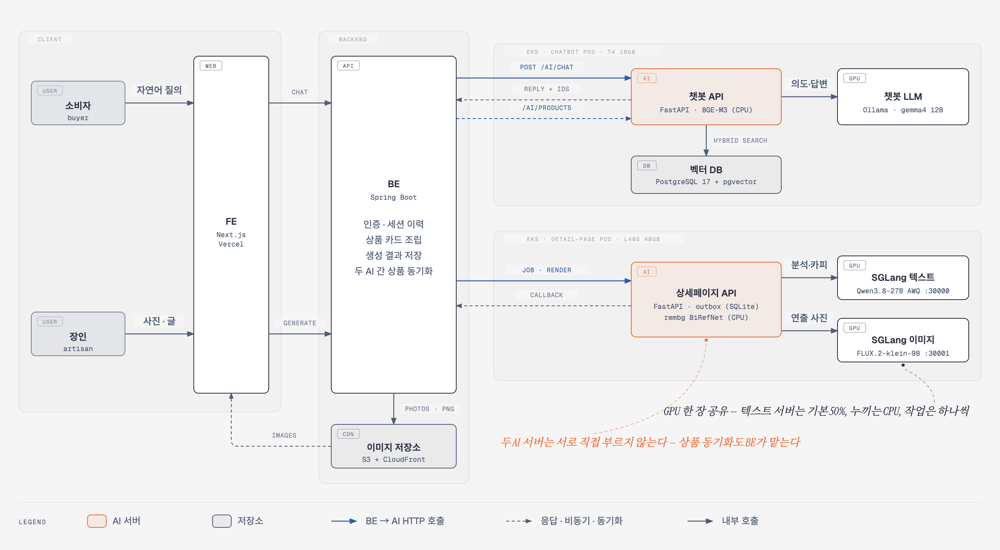

# 🏺 미담 Midam · GenAI

<p align="center">
  
</p>

<h3 align="center">작품의 서사로 팔고, 의미로 추천합니다</h3>

<p align="center">
  장인이 올린 사진과 글로 <strong>상세페이지 초안</strong>을 만들고,<br>
  소비자의 자연어 질문을 이해해 <strong>의미가 맞는 작품</strong>을 찾아 주는<br>
  <strong>장인 공예 커머스 미담의 생성형 AI 저장소</strong>
</p>

<p align="center">
  <a href="https://github.com/Jangingmall/GenAI/actions/workflows/genai-ci.yml"></a>
</p>

<p align="center">
  
  
  
  
  
</p>

<p align="center">
  <strong>Qwen3.8-27B · FLUX.2-klein-9B · rembg BiRefNet · gemma4 12B · BGE-M3</strong>
</p>

---

## 📑 목차

1. [서비스 흐름](#service-flow)
2. [핵심 기술 문제와 해결](#technical-solutions)
3. [시스템 아키텍처](#system-architecture)
4. [구현 및 배포 범위](#implementation-and-deployment)
5. [테스트 및 품질 관리](#quality-assurance)
6. [기술 스택](#tech-stack)
7. [프로젝트 구조](#project-structure)
8. [실행 방법](#getting-started)
9. [주요 API](#main-api)
10. [협업 방식](#collaboration)

<br>

<a id="service-flow"></a>

## ✨ 서비스 흐름

미담은 국가 공인 장인과 공예 작가의 작품을 **그 서사와 함께** 파는 커머스입니다.
후기·판매량이 아니라 작품의 의미와 장인의 이야기로 추천하므로, 후기가 0건인 신규·전통
장인의 작품도 노출됩니다. 이 저장소는 그중 두 AI 기능을 맡습니다.

### 1. AI 상세페이지 생성 (`page_generation/`) — 장인용

```text
사진·상품명·제작 과정·관리 방법 입력
→ 사진 분석과 카피 초안 (Qwen3.8-27B)
→ 판매자가 초안 확인·수정·승인
→ 원본 보존 누끼와 연출 사진 생성 (rembg BiRefNet · FLUX.2-klein-9B)
→ 섹션별 PNG와 React 문서(react_document) 렌더
→ BE로 결과 전달 → 상품 상세 화면에 노출
```

- 사진의 공예 종류·소재·형태를 읽고, 장인의 글을 근거로 섹션별 문구를 씁니다
- 원본 제품 사진은 다시 그리지 않고 보존합니다. 생성 사진은 연출·보조 컷에만 씁니다
- 결과는 PNG 한 장과 `react_document`(FE가 허용된 컴포넌트로만 그리는 JSON 문서)로 함께 넘깁니다. 판매자가 고친 초안 문구는 draft API로 저장합니다
- 처리 시간이 길어 비동기로 동작합니다: `QUEUED → ANALYZING → DRAFT_READY → (승인) → RENDERING → COMPLETED`

### 2. AI 추천 챗봇 (`chat_bot/`) — 소비자용

```text
"부모님 선물로 10만 원대 전통 공예품 추천해줘"
→ 의도 분류·조건 추출 (gemma4 12B)
→ 쿼리 임베딩 (BGE-M3)
→ 하이브리드 검색 (pgvector + BM25 + RRF, 가격 필터, 유사도 컷 τ)
→ 공인 등급 가중 랭킹 (최대 3개)
→ 근거 기반 답변·후속 질문 생성
→ { reply, intent, product_ids, suggestions }
```

- 동기 응답입니다. BE가 `product_ids`로 상품 카드를 조립해 화면에 보여 줍니다
- "그중 더 싼 거"처럼 이어지는 질문은 직전 후보와 조건을 기억해 좁혀 갑니다
- 맞는 작품이 없으면 억지로 추천하지 않고 빈 결과와 안내 문구를 돌려줍니다

### 두 기능의 연결

```text
[상세페이지 생성] → BE에 상품 저장 → BE가 /ai/products로 챗봇에 동기화 → 챗봇 검색 대상
```

이미 판매 중(`ON_SALE`)인 상품은 BE의 일괄 동기화 Job이 전체를 한 번 순회해 `/ai/products`로 처음 적재합니다.

두 AI 서버는 서로를 직접 호출하지 않고 BE를 통해서만 이어집니다. 장인이 쓴 제작 이야기와
관리법은 상세페이지의 재료이자 챗봇 검색의 근거가 됩니다.

<br>

<a id="technical-solutions"></a>

## 🧩 핵심 기술 문제와 해결

### 없는 사실을 지어내지 않습니다

공예품은 소재·공정·인증이 곧 가격의 근거라, AI가 그럴듯한 공정이나 인증을 지어내면
그대로 허위 표시가 됩니다.

```text
장인의 글·사진 = 근거
→ 생성 문구마다 근거 표시 (사진에서 보임 / 추정)
→ 고객용 특징·카피는 '사진에서 보임' 근거만 통과
→ 나머지는 빼고, 장인이 입력한 내용으로 확인되지 않으면 '확인 필요' 항목으로 판매자에게 전달
→ 판매자가 승인한 초안만 렌더
```

챗봇도 같은 원칙입니다. evidence(장인 서술·인증 등급)에 없는 내용은 "확인되지 않음"으로
답하고, 유사도 컷 τ 아래의 후보는 추천하지 않습니다.

### 원본 사진은 보존하고, 생성은 연출에만 씁니다

생성 모델이 제품을 다시 그리면 무늬·형태가 미묘하게 바뀌어 실물과 달라집니다.

- 대표 컷(`hero`)은 촬영 원본을 그대로 씁니다
- 배경 제거는 rembg BiRefNet으로 하고, 누끼가 제품을 깎아 먹었는지 보존율·배경 잔존을 게이트로 검사합니다
- 게이트를 통과하지 못하면 원본으로 되돌립니다(`FALLBACK`)
- FLUX.2-klein으로 만든 연출 컷은 `product_generated=true`로 구분해 실물 근거로 쓰지 않습니다

### GPU 한 장에 텍스트·이미지 모델을 같이 올립니다

상세페이지 Pod는 L40S 48GB 한 장에서 SGLang 텍스트 서버(Qwen3.8-27B AWQ INT4)와 이미지
서버(FLUX.2-klein-9B 4bit), FastAPI를 함께 띄웁니다. Stage에서 GPU 메모리 경합으로 생성이
실패한 경험을 바탕으로 다음과 같이 나눴습니다.

- 텍스트 서버가 쓰는 GPU 메모리를 기본 50%로 제한합니다(`--mem-fraction-static`, `TEXT_MEM_FRACTION`으로 조정)
- 누끼(onnxruntime)는 GPU 대신 CPU에서 돌리고, 같은 원본은 한 번만 계산해 재사용합니다
- 생성 작업은 한 번에 하나씩 처리해 두 모델의 순간 메모리가 겹치지 않게 합니다
- 모델 프로세스가 죽으면 API도 비정상 종료해 컨테이너가 재시작되게 합니다(죽은 모델 뒤에서 요청을 받지 않음)

### 비동기 작업의 결과를 잃지 않습니다

생성에 수 분이 걸리므로 BE는 작업만 맡기고, AI가 끝난 뒤 결과를 BE 저장 API로 보냅니다.

- 작업 상태와 전달 대기 결과를 SQLite에 저장해 재시작해도 이어서 보냅니다(outbox)
- 같은 요청이 두 번 들어와도 멱등 키로 한 번만 처리합니다
- 전달이 실패하면 재시도하되, 다시 보낼 때도 BE 계약 형식(camelCase 필드)을 그대로 지킵니다

### 챗봇 LLM의 메모리와 첫 응답을 다스렸습니다

- llama.cpp의 프롬프트 캐시·컨텍스트 체크포인트가 RAM에 쌓여 컨테이너가 강제 종료되던 문제를,
  상한을 고정해 해결했습니다(캐시 2,048MiB, 체크포인트 2개)
- LLM 사이드카가 뜰 때 모델을 미리 올리고, 올라가기 전에는 준비 확인(`/ai/ready`)이 실패해 트래픽을 받지 않습니다
- API는 기동을 막지 않고 백그라운드에서 LLM 연결과 워밍업을 재시도합니다. 워밍업이 끝나기 전에는 `/ai/ready`가 준비 안 됨으로 답해, 임베딩 모델까지 올라간 뒤에야 사용자 요청을 받습니다

<br>

<a id="system-architecture"></a>

## 🏗️ 시스템 아키텍처

<p align="center">
  
</p>

소비자·장인·FE는 **BE만** 상대하고, AI 서버는 BE 뒤에서 BE하고만 통신합니다.

- **추천 챗봇 (동기):** BE가 `POST /ai/chat`을 부르면 챗봇 API가 BGE-M3로 질의를 임베딩하고, 벡터 DB에서 하이브리드 검색한 뒤 gemma4로 의도 분류·답변을 만들어 `reply + product_ids`를 돌려줍니다. 상품이 등록·수정·삭제될 때마다 BE가 `/ai/products`로 챗봇 DB를 맞춥니다.
- **상세페이지 생성 (비동기):** BE가 작업을 맡기면(`202`) 상세페이지 API가 SGLang 텍스트 서버로 분석·카피 초안을 만듭니다(`DRAFT_READY`). 판매자가 승인하면 SGLang 이미지 서버로 연출 사진을 만들고 섹션을 렌더해, 결과를 BE에 콜백합니다. BE는 사진과 PNG를 S3에 저장하고 CloudFront로 FE에 제공합니다.
- 다이어그램 원본은 [`docs/images/genai-architecture.html`](docs/images/genai-architecture.html)(인라인 SVG)이며, 고친 뒤 SVG 영역을 PNG로 다시 내보내 `genai-architecture.png`를 바꿉니다.

### 책임 경계

| 파트 | 책임 |
|---|---|
| FE | 입력 UI, BE 호출, 상품 카드·상세페이지 렌더 |
| BE | 인증, 세션·대화 이력, AI 호출, 상품 카드 조립, 생성 결과 저장, 두 AI 간 상품 동기화 |
| 챗봇 AI | 자연어 이해·검색·랭킹·답변 생성, 자체 벡터 DB 운영. 대화 이력은 BE가 넘겨 주고, 챗봇은 좁혀 가기용 후보·조건만 `session_id`별로 메모리에 보관(30분, 최대 500개) |
| 상세페이지 AI | 사진 분석, 카피 생성, 원본 보존 누끼·연출 사진, 섹션 렌더(PNG·`react_document`) |

<br>

<a id="implementation-and-deployment"></a>

## 🚀 구현 및 배포 범위

| 영역 | 구현 내용 |
|---|---|
| 상세페이지 AI | 사진·글 분석, 근거 대조 카피, 초안 승인 흐름, 원본 보존 누끼·연출 사진, PNG·`react_document` 렌더, BE 콜백 outbox |
| 추천 챗봇 | 의도 분류·조건 추출, 하이브리드 검색·RRF·유사도 컷, 등급 가중 랭킹, 멀티턴 좁혀 가기, 상품 동기화 API |
| 모델 서빙 | SGLang(텍스트·이미지, 단일 GPU 공존), Ollama(gemma4 12B, 사전 적재) |
| 관측 | 두 서버 모두 Prometheus `/metrics`, 준비 확인(`/health/ready`, `/ai/ready`) |
| CI/CD | PR 테스트·Docker 검증, `main` 반영 시 ECR 이미지 발행 |

### 배포 구성 (AWS EKS · Stage)

| Pod | GPU | 구성 |
|---|---|---|
| `ai-sglang` (상세페이지) | NVIDIA L40S 48GB | 단일 컨테이너: SGLang 텍스트 + SGLang 이미지 + FastAPI |
| `ai-ollama` (챗봇) | NVIDIA T4 16GB | API 컨테이너(FastAPI + BGE-M3, CPU) + LLM 컨테이너(Ollama + gemma4, GPU) |
| `ai-vector-db` | — | PostgreSQL 17 + pgvector |

- 컨테이너 이미지: ECR `jangin-ai/page-generation`, `jangin-ai/chatbot-api`, `jangin-ai/chatbot-llm`
- 상세페이지 모델(Qwen3.8-27B·FLUX.2-klein)과 챗봇 임베딩(BGE-M3)은 S3 → PVC로 마운트하고, 챗봇 LLM(gemma4:12b)은 `chatbot-llm` 이미지 빌드 때 넣습니다
- 외부 생성 API는 쓰지 않고 모든 모델을 자체 호스팅합니다

### 배포 자동화

```text
PR
→ 서비스별 테스트 (page-generation · chatbot-api)
→ Docker 빌드 검증 (page-generation · chatbot-api · chatbot-llm)

main 반영
→ 테스트 재실행
→ GitHub Actions OIDC로 ECR 로그인
→ 소스 SHA 고정 태그로 이미지 빌드·push (대용량 GPU 이미지는 AWS CodeBuild 러너)
→ digest를 Actions Summary에 기록

Stage 반영 (수동)
→ 발행된 digest를 인프라 팀에 전달 → 인프라 저장소의 배포 설정에 digest 반영 → Stage 배포
```

<br>

<a id="quality-assurance"></a>

## ✅ 테스트 및 품질 관리

| 영역 | 검증 범위 | 최근 결과 (2026-10-05) |
|---|---|---|
| 상세페이지 AI | API 계약, 작업 상태 전이, 근거 대조·안전 문구, 누끼 보존 게이트, 렌더, outbox 재전송, 모델 서버 기동 스크립트 | 536 passed — main CI |
| 추천 챗봇 | 의도 분류, 검색·랭킹, 좁혀 가기, 응답 계약, 상품 동기화, 준비 확인 | 303 passed, 3 deselected(실제 LLM 호출) — main CI |
| 이미지 | 서비스별 Dockerfile 검사와 linux/amd64 빌드 (PR에서만 실행) | 3종 통과 — PR CI |

평가 데이터도 함께 관리합니다.

- 상세페이지: 클리블랜드 미술관 공개(CC0) 소장품 사진 60점으로 전체 파이프라인을 돌려 60/60 완주, 누끼 보존 기준선 관리 — [`full60-runs.md`](page_generation/docs/phase4/evaluation/full60-runs.md)
- 챗봇: 의도·검색·생성 평가셋 — [`chat_bot/eval/`](chat_bot/eval)

### 로컬 검증 명령

```bash
# 상세페이지 AI
cd page_generation
uv run --project . pytest -q

# 추천 챗봇
cd chat_bot
python -m pytest -q -k 'not real_llm'
```

<br>

<a id="tech-stack"></a>

## 🛠️ 기술 스택

| 구분 | 기술 | 사용 목적 |
|---|---|---|
| Server | FastAPI, Pydantic v2 | 두 AI 서버와 BE 간 요청·응답 계약 |
| Text·Vision LLM | Qwen3.8-27B (AWQ INT4) | 사진 분석, 상세페이지 카피 |
| Image Generation | FLUX.2-klein-9B (4bit) | 연출·보조 사진 생성 |
| Background Removal | rembg BiRefNet (ONNX) | 원본 보존 누끼 |
| Chat LLM | gemma4 12B (GGUF) | 의도 분류, 근거 기반 답변 |
| Embedding | BGE-M3 (1024차원, CPU) | 쿼리·상품 임베딩 |
| Search | pgvector, BM25(Kiwi), RRF | 의미·키워드 하이브리드 검색 |
| Serving | SGLang, Ollama | 자체 호스팅 모델 서빙 |
| Rendering | HTML/CSS + Playwright(Chromium) | 섹션 PNG 렌더 |
| Persistence | SQLite, PostgreSQL 17 | 작업·outbox 상태 / 챗봇 카탈로그·벡터 |
| Observability | prometheus-fastapi-instrumentator | 요청 수·지연·오류 지표 |
| Infra | AWS EKS, ECR, S3, CodeBuild | 배포, 이미지 저장, 모델 가중치, 대용량 빌드 |
| CI/CD | GitHub Actions | 테스트, Docker 검증, ECR 발행 |
| Local | MLX Serve (Mac), Ollama | 로컬 개발용 모델 구동 |

<br>

<a id="project-structure"></a>

## 🗂️ 프로젝트 구조

```text
GenAI/
├── page_generation/                 # AI 상세페이지 생성 (Python 3.13)
│   ├── src/detail_page_ai/          # API, 파이프라인, 검증, 누끼, 렌더, outbox
│   ├── web/                         # 상세페이지 HTML/CSS 템플릿
│   ├── deploy/sglang/               # 단일 GPU 통합 이미지 (Dockerfile, entrypoint)
│   ├── assets/                      # 템플릿 레퍼런스·샘플
│   ├── data/evaluation/             # 평가 데이터 (CC0 소장품 사진 60점)
│   ├── docs/                        # 운영·평가 문서
│   └── tests/
├── chat_bot/                        # AI 추천 챗봇 (Python 3.11)
│   ├── app/                         # API, 파이프라인(의도·검색·랭킹·생성), 적재
│   ├── deploy/ollama/               # LLM 사이드카 이미지 (모델 사전 적재)
│   ├── eval/                        # 평가셋
│   ├── Dockerfile                   # 챗봇 API 이미지
│   └── tests/
├── docs/                            # 협업 규칙·운영 기록
│   └── images/                      # README 이미지 (아키텍처 HTML 원본 포함)
├── .github/workflows/genai-ci.yml   # CI/CD
└── README.md
```

### 상세 문서

| 파트 | 문서 |
|---|---|
| 상세페이지 AI | [`page_generation/README.md`](page_generation/README.md) |
| 상세페이지 서버 운영 | [`page_generation/docs/phase4/operations/ubuntu-deployment.md`](page_generation/docs/phase4/operations/ubuntu-deployment.md) |
| 추천 챗봇 | [`chat_bot/README.md`](chat_bot/README.md) |
| 챗봇 컨테이너 | [`chat_bot/README-docker.md`](chat_bot/README-docker.md) |
| 협업 규칙 | [`docs/git_guide.md`](docs/git_guide.md), [`docs/code_style.md`](docs/code_style.md) |

<br>

<a id="getting-started"></a>

## ▶️ 실행 방법

두 기능은 폴더마다 가상환경을 따로 둡니다. 모델은 로컬(Mac)에서는 MLX Serve·Ollama로,
서버에서는 SGLang·Ollama로 띄웁니다.

### 상세페이지 AI (Mac · MLX Serve)

```bash
cd page_generation
cp local.env.example .env
python3.13 -m venv .venv
source .venv/bin/activate
python -m pip install -e '.[dev]'
npm install
npx playwright install chromium

# 모델 서버 (Qwen3.8-27B와 FLUX.2-klein을 같은 인스턴스에서 제공)
"/Applications/MLX Core.app/Contents/MacOS/mlx-serve" serve \
  --model ~/.mlx-serve/models/ddalcu/Qwen3.8-27B-MLX-Serve-4bit \
  --host 127.0.0.1 \
  --port 11234

# AI 서버
serve-ai
```

| 항목 | URL |
|---|---|
| Swagger UI | `http://127.0.0.1:8000/docs` |
| Health / Ready | `http://127.0.0.1:8000/health`, `/health/ready` |
| Metrics | `http://127.0.0.1:8000/metrics` |

서버(GPU) 구성은 [`ubuntu-deployment.md`](page_generation/docs/phase4/operations/ubuntu-deployment.md)의 SGLang 경로를 따릅니다.

### 추천 챗봇

```bash
cd chat_bot
python3.11 -m venv .venv
source .venv/bin/activate
pip install -r requirements.txt

python verify_env.py                 # 전부 ✅면 준비 완료 (Ollama에 gemma4:12b 필요)

python -m app.ingest.load_products \
  --file data/장인몰_샘플_product.csv \
  --artisan-file data/장인몰_샘플_artisan.csv

uvicorn app.main:app --host 0.0.0.0 --port 8000
```

컨테이너 실행(임베딩 모델·DB 비밀번호 마운트)은 [`chat_bot/README-docker.md`](chat_bot/README-docker.md)를 참고합니다.

### 주요 환경변수

```text
# 상세페이지 AI
LOCAL_TEXT_PROVIDER / LOCAL_TEXT_URL / LOCAL_TEXT_MODEL      # mlx 또는 sglang
LOCAL_IMAGE_PROVIDER / LOCAL_IMAGE_URL / LOCAL_IMAGE_MODEL
BACKGROUND_PROVIDER
BACKEND_URL / BACKEND_AUTH_TOKEN                             # 결과 콜백
AI_INTERNAL_AUTH_TOKEN                                       # BE → AI 호출 인증

# 추천 챗봇
LLM_BACKEND=ollama / OLLAMA_HOST / LLM_MODEL=gemma4:12b
EMBED_MODEL=BAAI/bge-m3
DB_HOST / DB_PORT / DB_NAME / DB_USER / DB_PASSWORD(_FILE)
```

실제 비밀값은 Git에 넣지 않습니다. Stage에서는 AWS에 보관한 값을 Secrets Store CSI 드라이버로 Pod에 파일로 마운트합니다(예: `DB_PASSWORD_FILE=/mnt/secrets-store/password`).

<br>

<a id="main-api"></a>

## 🔌 주요 API

두 서버 모두 BE만 호출합니다. 외부 공개 경로(`/api/chatbot/...`, `/api/content/...`)는 BE가 제공합니다.

### 상세페이지 AI

| Method | Endpoint | 역할 |
|---|---|---|
| `POST` | `/internal/v1/ai/detail-page-jobs` | 생성 작업 접수 (202, 비동기) |
| `GET` | `/internal/v1/ai/detail-page-jobs/{job_id}` | 작업 상태·초안 조회 |
| `PUT` | `/internal/v1/ai/detail-page-jobs/{job_id}/draft` | 판매자가 고친 초안 저장 |
| `POST` | `/internal/v1/ai/detail-page-renders` | 승인된 초안 렌더 → 결과를 BE로 콜백 |
| `GET` | `/health`, `/health/ready` | 생존·준비 확인 (모델 서버 포함) |
| `GET` | `/metrics` | Prometheus 지표 |

### 추천 챗봇

| Method | Endpoint | 역할 |
|---|---|---|
| `POST` | `/ai/chat` | 추천 대화 → `{ reply, intent, product_ids, suggestions }` |
| `POST` | `/ai/products` | 상품 등록 동기화 (저장 후 임베딩) |
| `PUT` | `/ai/products/{product_id}` | 상품 수정 동기화 |
| `DELETE` | `/ai/products/{product_id}` | 상품 삭제 동기화 |
| `GET` | `/ai/health`, `/ai/ready` | 생존·준비 확인 (DB·임베딩·LLM) |
| `GET` | `/metrics` | Prometheus 지표 |

대표적인 상세페이지 생성 흐름은 다음과 같습니다.

```text
FE → BE : 사진 + 상품명·제작 과정·관리 방법
BE → AI : POST /internal/v1/ai/detail-page-jobs → 202 + job_id
AI      : QUEUED → ANALYZING → DRAFT_READY
BE → FE : 초안 확인·수정 → 승인
BE → AI : POST /internal/v1/ai/detail-page-renders
AI      : RENDERING → 사진·섹션 PNG·react_document 생성
AI → BE : 결과 콜백 (실패 시 outbox 재전송) → COMPLETED
```

<br>

<a id="collaboration"></a>

## 🤝 협업 방식

`main`에 직접 커밋하지 않고, 작업 브랜치에서 Pull Request로 병합합니다. 자세한 규칙은
[`docs/git_guide.md`](docs/git_guide.md)에 있습니다.

```text
feat/* · fix/* · docs/* · refactor/*
→ 로컬 테스트
→ Commit · Push
→ main 대상 Pull Request
→ CI (테스트 · Docker 검증) 통과
→ main 병합
→ ECR 이미지 발행 → digest를 인프라 팀에 전달(수동) → Stage 반영
```

| 타입 | 의미 | 예시 |
|---|---|---|
| `feat` | 기능 추가 | `feat: 벡터 검색 기본 구현` |
| `fix` | 오류 수정 | `fix: preserve BE callback aliases across outbox retries` |
| `docs` | 문서 변경 | `docs: README 세팅 방법 추가` |
| `refactor` | 기능 변화 없는 코드 개선 | `refactor: 랭킹 로직 함수 분리` |
| `test` | 테스트·평가셋 | `test: 인젝션 방어 평가셋 추가` |
| `chore` | 설정·의존성 | `chore: requirements 업데이트` |

`.env`, 가상환경, 모델 가중치·캐시는 커밋하지 않습니다.

<details>
<summary><strong>운영 시 주의 사항</strong></summary>

<br>

- **챗봇 임베딩은 torch ≥ 2.6이 필요합니다.** BGE-M3는 `.bin`(pickle) 가중치만 제공하고, transformers가 CVE-2025-32434 때문에 torch 2.6 미만에서는 `.bin` 로딩을 거부합니다. CI 검증 조합(2026-10-05): `torch==2.6.0 / transformers==5.18.0 / sentence-transformers==6.1.0`
- **FLUX 이미지 모델 라이선스:** 원본이 비상업 라이선스(FLUX NCL) 계열이라 상업 이용 범위 확인이 필요합니다.
- **챗봇 재배포 공백:** GPU가 한 장이라 배포 방식이 Recreate입니다. 새 Pod가 모델을 올리는 몇 분 동안 챗봇이 응답하지 못하므로, 사용이 적은 시간에 배포합니다.
- **상세페이지 처리 시간:** 분석·생성·렌더가 GPU 한 장에서 순서대로 돌아 건당 수 분이 걸립니다. 동시에 들어온 작업은 대기열에서 차례를 기다립니다.
- **상세페이지 메모리:** 렌더 중 컨테이너 RAM 사용이 약 22GiB까지 오르므로 Pod 메모리 한도를 그 이상으로 유지합니다.

</details>

---

<p align="center">
  <strong>🏺 작품의 서사로 팔고, 의미로 추천합니다</strong><br>
  장인의 글에서 시작해 상세페이지와 추천까지 이어지는 미담의 생성형 AI
</p>
